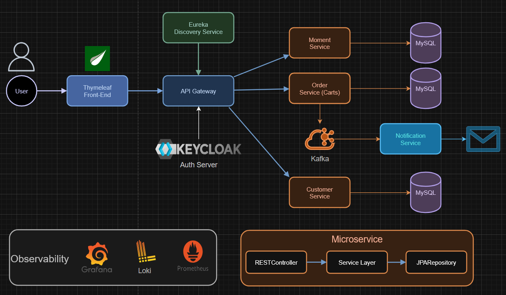
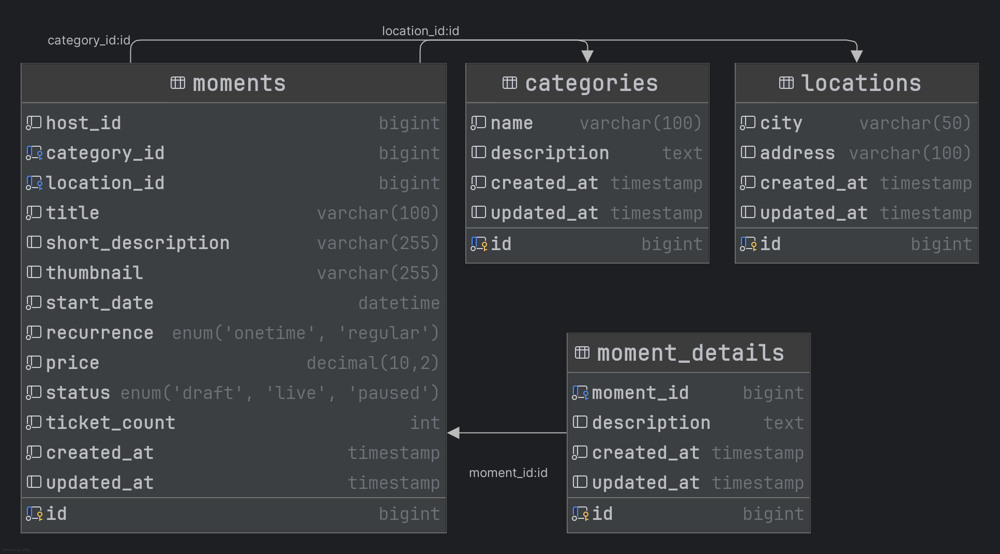
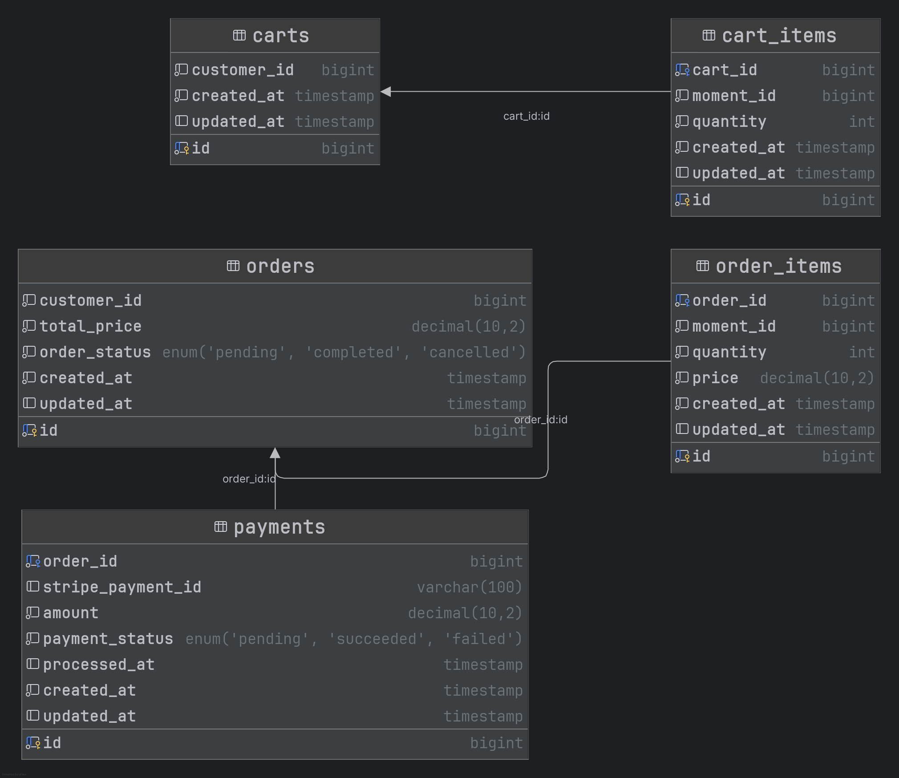
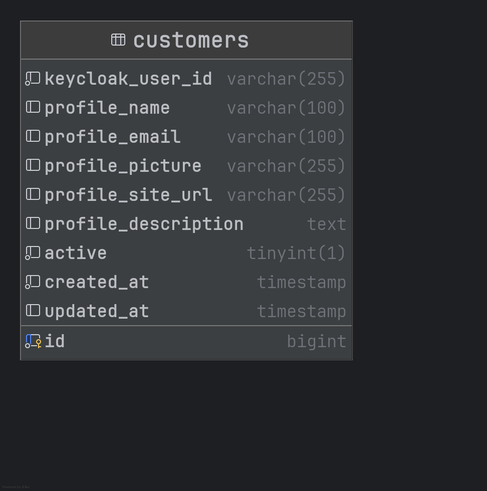

# Moments Event Platform

Welcome to the **Moments Event Platform** repository! This is a fully-featured eCommerce solution for building scalable, customizable, and high-performance event system for hosting your own, finding and attending the events of others. It supports everything you need for event management, secure order system, user authentication and to showcase events. The platform is designed with a modular microservice architecture, making it easy to extend and integrate with other systems.

## Table of Contents

1. [Project Overview](#project-overview)
2. [Features](#features)
3. [Architecture](#architecture)
4. [System Design](#system-design)
5. [Setup and Installation](#setup-and-installation)
6. [Folder Structure](#folder-structure)
7. [API Documentation](#api-documentation)
8. [Contributing](#contributing)
9. [License](#license)

## Project Overview

The **Moments Event Platform** is a robust solution for creating and managing online event hosting and ticket sales. It offers everything required for modern eCommerce businesses: from handling event listings, processing customer orders, and managing stock, to user authentication and payments.

This platform supports:

* Event listing and detailed event profile/status management
* Secure payment processing planned for the future (via Stripe)
* A highly scalable and feature-stable cloud architecture
* Real-time order tracking
* User accounts with personalized dashboard and profile
* Advanced event search, filtering, sorting, and pagination
* Fully responsive design for mobile and desktop using Bootstrap

## Features

### Event Management

* **Create, update, and delete events**: Users can add new events, update existing event details, and remove obsolete events.
* **Categorize events**: Events can be grouped by categories (e.g. Art, Music, Food & Comedy).
* **Advanced filtering and sorting**: Users can sort products by date, city, title, price, category or recurrence.

### User Authentication & Authorization

* **Role-based access control**: Users and admin have different roles with different permissions.
* **Login securely**:  over Keycloak supporting OpenID Connect (OIDC) and OAuth 2 industry standards.
* **Password hashing**: Users' passwords are securely hashed using industry-standard algorithms.
* **Email verification**: Users must verify their email upon registration before they can make purchases.

### Shopping Cart & Checkout

* **Add/remove items**: Users can easily add or remove items from their cart.
* **Adjust quantities**: Customers can modify the quantity of items in their cart.
* **Real time ticket stock**: Ticket availability shown in cart before ordering.
* **Order confirmation**: Displays the final price, including taxes, shipping costs, and applied discounts.
* **Email notification**: After ordering a message is sent to the users email address with the order.

<!--- ### Order Management

* **Track orders**: Both customers and admins can track orders through every stage (processing, shipped, delivered).
* **Generate invoices**: Invoices are generated automatically and emailed to customers after successful purchase.
* **Returns & Refunds**: Users can initiate returns, and admins can approve or deny them.
* **Order history**: Customers can view all their past orders and statuses.

### Payment Gateway Integration

* **Multiple payment methods**: Supports Stripe (credit/debit cards) and PayPal for payment processing.
* **Secure transactions**: PCI-compliant and fully encrypted payment system.
* **Currency conversion**: Built-in support for handling multiple currencies.
* **Tax calculation**: Dynamic tax calculation based on user location.

### Analytics Dashboard

* **Sales performance**: Track total sales, daily/weekly/monthly revenue, and best-selling products.
* **User activity**: See which users are active, when they registered, and what products they’ve purchased.
* **Product performance**: View which products are frequently purchased, have the highest reviews, and are most popular.

### Customer Support Integration

* **Contact support**: Customers can directly contact support teams for assistance via email or live chat.
* **Help Center**: A knowledge base where customers can find answers to common questions. --->

## Architecture

The platform follows a **Microservices Architecture** with each service being responsible for a specific feature:

### **Microservices Breakdown:**

* **Moment Service**:

  * Manages event data: event creation, updating, removal, and categorization.
  * Stores event details like price, description, stock, etc.
  * Analytics such as event count by categories and cities.

* **Order Service**:

  * Handles the entire order lifecycle: from managing items in the shopping cart system to the actual order.
  * Takes care of order creation, payment processing, order status and confirmation.
  * Confirmation is done both on the website and securely via email.
  <!-- * Communicates with payment gateways like **Stripe** and **PayPal** for secure transactions.
  * Interfaces with third-party providers like **Stripe** and **PayPal** to process payments securely. -->

* **Customer Service**:

  * Authenticates and authorizes users via **JWT tokens**.
  * Stores and edits user profile.
  * Offers role-based access control (admin, user).

* **Notification Service**:

  * Handles email notifications (via **Mailtrap**) for order confirmations.

### **System Design Diagram:**

Below is a high-level system design diagram showcasing the different services and how they interact:



## System Design

### API Gateway:

* An API Gateway is used to route API requests to appropriate services. This provides a single entry point for external requests and helps with load balancing, security, and performance.

### Eureka Naming Server:

* For service discovery, to know addresses of microservice instances dynamically.

### Keycloak:

* Secure OAuth 2.0 and OpenID Connect (OIDC) server for both login and user registration with
  verified email.

### Kafka, Zookeeper, Kafka UI, Avro, Schema registry:

* To publish from order service, store and sent messages to the notification service, which in turn
  sends an email to the user with Javamail using Mailtrap.

### Database Design:

* **Customers**:  
  Stores customer profiles, linking users via their Keycloak identity. Includes details like name,
  email, profile picture, personal website URL, and a short description. Tracks account activity
  status and timestamps for creation and updates.
* **Moments**:  
  Represents events or moments created by users. Contains information such as title, short
  description, thumbnail, pricing, ticket count, scheduling (including recurrence), and status (
  e.g., draft, live). Each moment is linked to a host, a category, and a location.
* **Moment Details**:  
  Holds extended descriptions for each moment, allowing richer content separate from the core moment
  data. Tracks creation and update timestamps and links directly to the corresponding moment.
* **Categories**:  
  Maintains a catalog of moment categories, with each entry including a name and an optional
  description. Used to classify moments/events.
* **Locations**:  
  Defines geographic locations for moments. Includes city and address fields. Used to assign a
  specific place to each event.
* **Carts**:  
  Represents shopping carts created by customers. Each cart belongs to a specific customer and
  tracks its creation and update times.
* **Cart Items**:  
  Tracks the contents of each cart, linking individual moments (events) with quantities to specific
  carts. Supports the process of assembling orders before purchase.

### Database Schema Diagrams:

* Moment Service Database Schema

<div align="center">
  
</div>
<br>

* Order Service Database Schema

<div align="center">
  
</div>
<br>

* Customer Service Database Schema

<div align="center">
  
</div>
<br>

### Technologies

**Backend Core:**  


**Security:**  


**Spring Cloud:**  


**Kafka Ecosystem for notification event:**  


**Email sent to customer:**  


**Database and Versioning:**  


**Frontend:**  


**Documentation:**  


**DevOps/Build:**  


**Testing:**  


## Setup and Installation

This guide will walk you through setting up the Moments Event Platform on your local development environment. The platform consists of several microservices that need to be configured and run together.

## Prerequisites

- Java 21 or higher
- Maven 3.9+
- Docker and Docker Compose
- MySQL 8.0+ (if not using Docker)
- Git

## Step 1: Clone the Repository

```bash
git clone https://github.com/bardha-islami/event-platform.git
cd Event-Platform
```

## Step 2: Review Service Ports

Below are the ports for all services in the Moments Event Platform (can be found in server_ports.txt):

| Service Type | Service Name | URL |
|--------------|-------------|-----|
| **Frontend** | Web Application | `http://localhost:8090` |
| **API Layer** | API Gateway | `http://localhost:9000` |
| **Core Services** | Moment Service | `http://localhost:8081` |
| | Order Service | `http://localhost:8082` |
| | Customer Service | `http://localhost:8083` |
| | Notification Service | `localhost:8084` |
| **Infrastructure** | Naming Server (Eureka) | `http://localhost:8761` |
| | Keycloak | `http://localhost:8181` |
| **Messaging** | Schema Registry | `http://localhost:8085` |
| | Kafka UI | `http://localhost:8086` |
| | Zookeeper | `localhost:2181` |
| | Kafka | `localhost:9092`, `localhost:29092` |
| **Databases** | MySQL (Moments) | `localhost:3307` |
| | MySQL (Orders) | `localhost:3308` |
| | MySQL (Customers) | `localhost:3309` |

## Step 3: Build the Application

We recommend running applications including tests first since Eureka and databases must be running for those.  
Then build all microservices.

```bash
# Build services (skip tests for final build, to include them Eureka and databases must be running)
./mvnw -f naming-server/pom.xml clean package -DskipTests
./mvnw -f api-gateway/pom.xml clean package -DskipTests
./mvnw -f moment-service/pom.xml clean package -DskipTests
./mvnw -f order-service/pom.xml clean package -DskipTests
./mvnw -f customer-service/pom.xml clean package -DskipTests
./mvnw -f notification-service/pom.xml clean package -DskipTests
./mvnw -f moments-web-app/pom.xml clean package -DskipTests
```

## Step 4: Run Applications with Environment Variables
Launch each service with the appropriate configuration by providing environment variables when starting the applications:

### Infrastructure Services

These services provide platform capabilities and don't require custom configuration for development:

```bash
# Naming Server (Eureka)
java -jar naming-server/target/naming-server-0.0.1-SNAPSHOT.jar

# API Gateway
java -jar api-gateway/target/api-gateway-0.0.1-SNAPSHOT.jar

# Start Docker Infrastructure (Keycloak)
docker-compose -f api-gateway/docker-compose.yml up -d

# Start Messaging Infrastructure (Kafka ecosystem)
docker-compose -f notification-service/docker-compose.yml up -d

# Start Database Infrastructure (if not using existing databases)
docker-compose -f moment-service/docker-compose.yml up -d
docker-compose -f order-service/docker-compose.yml up -d
docker-compose -f customer-service/docker-compose.yml up -d
```

### Core Services

Databases are set to work out of the box with the ones provided by docker compose in a development environment (leave the environment variables for the database away then e.g. ava -jar target/moment-service-0.0.1-SNAPSHOT.jar), but should be changed for production.

#### Moment Service
```bash
java -jar target/moment-service-0.0.1-SNAPSHOT.jar \
  --spring.datasource.url=jdbc:mysql://localhost:3307/moments_db \
  --spring.datasource.username=your_username \
  --spring.datasource.password=your_password
```

#### Order Service
```bash
java -jar target/order-service-0.0.1-SNAPSHOT.jar \
  --spring.datasource.url=jdbc:mysql://localhost:3308/orders_db \
  --spring.datasource.username=your_username \
  --spring.datasource.password=your_password
```

#### Customer Service
```bash
java -jar target/customer-service-0.0.1-SNAPSHOT.jar \
  --spring.datasource.url=jdbc:mysql://localhost:3309/customers_db \
  --spring.datasource.username=your_username \
  --spring.datasource.password=your_password
```

#### Notification Service
```bash
java -jar target/notification-service-0.0.1-SNAPSHOT.jar \
  --spring.mail.host=sandbox.smtp.mailtrap.io \
  --spring.mail.port=2525 \
  --spring.mail.username=your_username \
  --spring.mail.password=your_password \
  --email-address=your_email
```

> **Note:** For the Notification Service, you'll need to register for a [Mailtrap](https://mailtrap.io/) account (or an alternative SMTP service) to obtain your username and password credentials. Set these as environment variables or replace the placeholders directly.

> **Database Configuration Note:** The development environment uses pre-configured database settings that work out of the box with the Docker setup. When moving to production, you should replace the database connection details with your production database parameters and implement proper security measures such as encrypted passwords and restricted database access.

### Configure Keycloak

For production change credentials after first login.

1. Access Keycloak admin console at http://localhost:8181
2. Login with the default credentials:
   - Username: `admin`
   - Password: `admin`
3. The "moments" realm should be automatically created 
4. Find the client "moments-web-app" in the clients section
5. Reset the client secret:
   - Go to the "Credentials" tab
   - Click "Regenerate Secret"
   - Copy the new client secret for the next step

### Run the Web Application

```bash
java -jar target/moments-web-app-0.0.1-SNAPSHOT.jar \
  --spring.security.oauth2.client.registration.moments-web-app.client-secret=YOUR_CLIENT_SECRET \
  --spring.mail.host=sandbox.smtp.mailtrap.io \
  --spring.mail.port=2525 \
  --spring.mail.username=your_username \
  --spring.mail.password=your_password \
  --email-address=your_email
```

## Verification

1. Check Eureka dashboard (http://localhost:8761) to ensure all services are registered
2. Visit the web app at http://localhost:8090
3. Test API endpoints through the API gateway at http://localhost:9000
   - Example: `http://localhost:9000/api/v1/moments` (note: no service name in path when using API gateway)

## Troubleshooting

- **Service not registering with Eureka**: Check if the service has the correct Eureka client configuration
- **Database connection errors**: Verify MySQL is running and credentials are correct
- **Keycloak authentication issues**: Ensure the client secret is correctly set in the web-app configuration
- **Services cannot communicate**: Make sure client interfaces are correctly configured with proper URLs

## Folder Structure

The Moments Event Platform follows a microservices architecture, with each service focused on specific business capabilities.

The Service Structure is exemplified here by order-service.

```
Moments-Event-Platform/
│
├── api-gateway/                   # API Gateway Service (entry point for requests)
│
├── customer-service/              # Customer Authentication and User Profiles
│
├── moment-service/                # Event/Moments Management Service
│
├── moments-web-app/               # Thymeleaf Frontend Application
│   └── src/
│       └── main/
│           ├── java/              # Java backend code
│           │   └── io/github/teamomo/momentswebapp/
│           │       ├── client/    # API clients to communicate with backend services
│           │       ├── config/    # Application configuration classes
│           │       ├── controller/ # MVC controllers
│           │       ├── dto/       # Data transfer objects
│           │       ├── entity/    # Domain models
│           │       ├── exception/ # Custom exception handling
│           │       ├── mapper/    # Object mappers between DTOs and entities
│           │       ├── security/  # Authentication and authorization
│           │       ├── service/   # Business logic
│           │       └── util/      # Helper utilities and common functions
│           │
│           └── resources/
│               ├── static/        # Static assets
│               │   ├── css/       # CSS stylesheets
│               │   ├── js/        # JavaScript files
│               │   └── img/       # Images
│               │
│               └── templates/     # Thymeleaf templates
│                   ├── fragments/ # Reusable template fragments
│                   └── [view templates]  # Individual page templates
│
├── naming-server/                 # Eureka Service Discovery
│
├── notification-service/          # Email and Notifications Service
│
├── order-service/                 # Order and Cart Management
│   ├── src/
│   │   ├── main/
│   │   │   ├── java/
│   │   │   │   └── io/github/teamomo/order/
│   │   │   │       ├── client/    # API clients to other microservices
│   │   │   │       ├── config/    # Service configuration
│   │   │   │       ├── controller/ # REST API controllers
│   │   │   │       ├── dto/       # Data transfer objects
│   │   │   │       ├── entity/    # JPA entities 
│   │   │   │       ├── exception/ # Custom exceptions
│   │   │   │       ├── mapper/    # Object mappers
│   │   │   │       ├── repository/ # Data access layer
│   │   │   │       ├── security/  # Service security configuration
│   │   │   │       ├── service/   # Business logic
│   │   │   │       └── util/      # Utility classes
│   │   │   │
│   │   │   └── resources/
│   │   │       ├── application.properties # Service configuration
│   │   │       ├── avro/          # Avro schema definitions for messaging
│   │   │       └── db/migration/           # SQL migration scripts
│   │   │
│   │   └── test/                  # Unit and integration tests
│   │
│   ├── docker/                    # Docker configuration and volumes
│   │
│   └── mysql/                     # MySQL database initialization script
```
<br>  

Each microservice follows a similar structure:

### Controller Layer
- **REST API endpoints** that handle HTTP requests and responses
  - Responsible for input validation and request routing
  - Maps DTOs to appropriate service methods

### Service Layer
- **Core business logic implementation**
  - Transaction management
  - Coordinates between repositories and external services
  - Implements domain-specific operations

### Repository Layer
- **Data access abstractions**
  - JPA repositories for database operations
  - Custom query methods

### Entity Layer
- **JPA entities that map to database tables**
  - Domain model with relationships and constraints

### DTO Layer
- **Data transfer objects for API communication**
  - Separates internal models from external representations

### Client Interfaces
- **Communication with other microservices**
  - Using Spring Declarative HTTP Interface Clients (RestClient)
  - Circuit breakers and retry mechanisms for resilience

### Infrastructure Components
- **Docker**: Container configurations and volume mappings
- **MySQL**: Database initialization and configuration
- **Avro Schemas**: Message format definitions for event streaming

### Frontend Structure (moments-web-app)

The frontend is built using Spring Boot with Thymeleaf for server-side rendering:

#### Controllers
- **Handle HTTP requests and prepare model data for views**
  - Map to specific URL paths
  - Communicate with microservices via clients

#### Templates
- **Thymeleaf HTML templates**
  - Organized by feature/page
  - Use fragments for reusable components

#### Static Resources
- **CSS** for styling
- **JavaScript** for client-side interactions
- **Images** and other media

This architecture enables the platform to scale individual services independently while maintaining clear separation of concerns and supporting independent development teams.

## API Documentation

Each microservice's REST API is documented by **Swagger using OpenAPI v3.1.0**, aggregated
on the API Gateway and can be found
under: http://localhost:9000/swagger-ui/index.html

The API provides various endpoints for managing moments, orders, customers, and carts within the
Moments Event Platform.
All endpoints listed below are rerouted through a secured API Gateway, which ensures centralized
authentication, authorisation, and request routing.

### Moment Service
**Base URL**: `/api/v1/moments`

#### Moment Endpoints
- **GET** : Retrieve all moments with optional filters.
- **GET** `/{id}`: Retrieve a moment by its ID.
- **POST** : Create a new moment.
- **PUT** `/{id}`: Update a moment by its ID.
- **DELETE** `/{id}`: Delete a moment by its ID.
- **GET** `/host/{id}`: Retrieve all moments by host ID.
<br><br>
- **GET** `/{id}/check-availability`: Check ticket availability for a specific moment.
- **POST** `/{id}/book-tickets`: Book tickets for a specific moment.
- **POST** `/{id}/cancel-tickets`: Cancel ticket booking for a specific moment.
<br><br>
- **GET** `/categories`: Retrieve all categories by moments count.
- **GET** `/categories/{id}`: Retrieve a category by its ID.
- **GET** `/cities`: Retrieve all cities by moments count.
- **POST** `/cart-items`: Retrieve cart items by moment IDs.

---

### Order Service

#### Cart Endpoints
**Base URL**: `/api/v1/orders/carts`

- **GET** `/{customerId}`: Retrieve the cart for a specific customer. If no cart exists, a new one
  will be created.
- **POST** `/{customerId}`: Create a new cart for a specific customer.
- **PUT** `/{customerId}`: Update the cart for a specific customer.
- **DELETE** `/{customerId}`: Delete the cart for a specific customer.
- **GET** `/{customerId}/items`: Fetch all items in the cart for a specific customer.
- **POST** `/{customerId}/items`: Add a new item to the cart for a specific customer.
- **PUT** `/{customerId}/items/{itemId}`: Update an item in the cart for a specific customer.
- **DELETE** `/{customerId}/items/{itemId}`: Delete an item from the cart for a specific customer.

#### Order Endpoints
**Base URL**: `/api/v1/orders`

- **GET** `/{orderId}`: Retrieve an order by its ID.
- **POST** `/{customerId}`: Create an order for a specific customer.

---

### Customer Service
**Base URL**: `/api/v1/customers`

#### Customer Endpoints
- **GET** `/{id}`: Retrieve a customer by its ID.
- **POST** `/check`: Check if a customer exists by Keycloak user ID, create a new one if not.
- **PUT** `/{id}`: Update a customer by its ID.
- **PATCH** `/{id}/active`: Update the active status of a specific customer.
- **DELETE** `/{id}`: Delete a customer by its ID.


## Contributing

We welcome contributions to this project! Whether it's bug fixes, feature additions, or
documentation improvements, your help is appreciated.

## License

This project is licensed under the **Apache-2.0 License**. See the [LICENSE](./LICENSE) file for more information.
